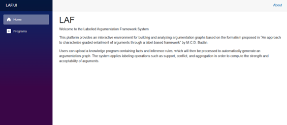
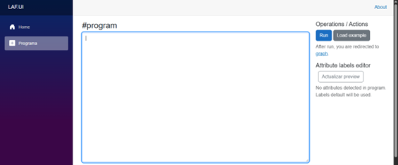
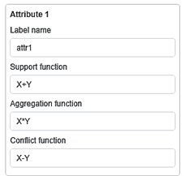
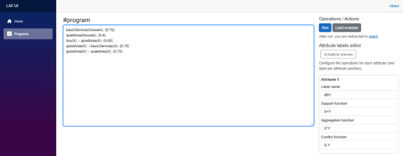
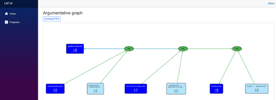
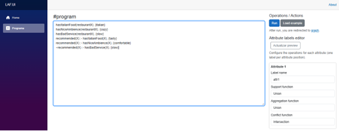
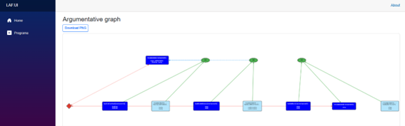

**System Overview**

The application interface is organized into three main sections:

- Home Screen (Welcome Page)
- Program Editor (Knowledge Input Page)
- About Section (Project Description)

Navigation is provided through a left-side menu, allowing the user to switch between the available views.

**Home Screen**

Upon launching the system, the user is presented with the Home page, which serves as the main entry point of the platform.

This screen provides a general introduction to the objective of the application and summarizes its theoretical foundation.

**Navigation Menu**

The left-side panel provides access to the main modules of the application:

- Home - Returns to the welcome screen.
- Program - Opens the knowledge program editor where users define facts and inference rules.

This structure ensures a simple and intuitive workflow.

**Program Editor**

The Program section is the core functional component of the system. It allows users to enter or load a formal knowledge program that will be processed in order to generate an argumentation graph.

To open the editor, the user must select: Sidebar → Program

**Knowledge Program Input**

The central text area of the Program Editor allows users to write or paste a knowledge base composed of facts and inference rules, which constitute the input for the construction of an argumentation graph.
> _Load example_ button contains a preconfigured example with a knowledge base about milk consumption.

A knowledge program in this system follows the Labelled Argumentation Framework (LAF) formalism, where each fact may be associated with one or more attribute valuations. These valuations represent graded information attached to arguments, capturing real-world features.

**Attribute Types**

The system supports two types of attributes:

1\. Numerical Attributes

Numerical attributes are represented through interval-valued degrees, normalized within the range \[0,1\]. These intervals typically represent quantitative measures such as trust, preference, strength, or relevance, following the graded semantics described in the underlying formalism.

Fact example:

<i>hasCalcium(milk). {0.3, 0.65}</i>

In this case, the fact hasCalcium(milk) is associated with a numerical valuation Interval {0.3,0.65}.  
 Rule example:

<i>strengthensBones(X) :- hasCalcium(X), hasVitaminD(X). {1.0, 0.9}</i>

In this case, the numerical attributes attached to the rule are {1.0, 0.9}.

2\. Qualitative Attributes

Qualitative attributes represent non-numeric properties, such as categories, symbolic features, or conceptual labels. They are typically expressed as sets of values rather than numeric intervals.

Fact example:

<i>environmentalImpact(milk). {high}</i>

Rule example:

<i>badForEnvironment(X) :- environmentalImpact(X). {high}</i>

These attributes do not encode magnitude, but rather descriptive or categorical information that participates in argument interactions.

**Attribute Operations**

The behavior of attributes during argument propagation is governed by attribute-specific operations, which differ depending on the attribute type.

For numerical attributes, operations are defined using the variables X and Y, which represent the valuations of interacting arguments.

This design follows directly from the algebra of argumentation labels described in the formal model, where operations are functions over numeric domains.

Examples of numerical operation definitions:

<i>Support: X + Y</i>

<i>Aggregation: X \* (Y/2)</i>

<i>Conflict: X - Y</i>

These expressions define how numerical values are propagated and modified throughout the argumentation graph.

At the current stage of the system, qualitative attributes support a restricted but well-defined set of operations:

- Union is used for Support and Aggregation.
- Intersection is used for Conflict.

**Attribute Configuration Panels**

For every attribute detected in the facts and rules of the uploaded knowledge program, the system automatically generates a corresponding attribute configuration panel on the right side of the program input area.

These panels allow the user to:

- Assign a custom label name to each attribute.
- Define the algebraic operations that govern how the attribute behaves during argument propagation.
- Configure the functions associated with the argumentation relations.

When the user loads or writes a program containing multiple attributes, the interface dynamically creates one configuration box per attribute. Each box corresponds to an attribute position in the valuation tuple, as defined in the underlying Labelled Argumentation Framework formalism.

Upon creation, each attribute panel is populated with default operations, providing an initial configuration for the most common numeric label behavior.

The system automatically proposes standard expressions such as:

- Support function: X + Y
- Aggregation function: X \* Y
- Conflict function: X - Y

These default values can later be modified by the user to reflect alternative algebraic semantics.

**Argumentative Graph Generation**

Once the knowledge program has been introduced in the input editor and the operations for each attribute have been configured, the system allows the user to execute the argumentation process and automatically generate the corresponding argumentative graph.

The user must press the _Run_ button located in the Operations / Actions panel on the right side of the interface.

This action triggers the complete reasoning pipeline:

- Parsing of facts and rules.
- Construction of argument structures.
- Propagation of attribute labels through support, aggregation, and conflict relations.
- Generation of the final argumentation graph representation

For example:

After execution, the system automatically redirects the user to the Argumentative Graph view.

The Argumentative Graph page also includes an export option through the Download PNG button, enabling users to save the generated graph as an image file for documentation or further analysis.

The following example illustrates a program where facts contain qualitative attribute values:

Argumentative graph:

